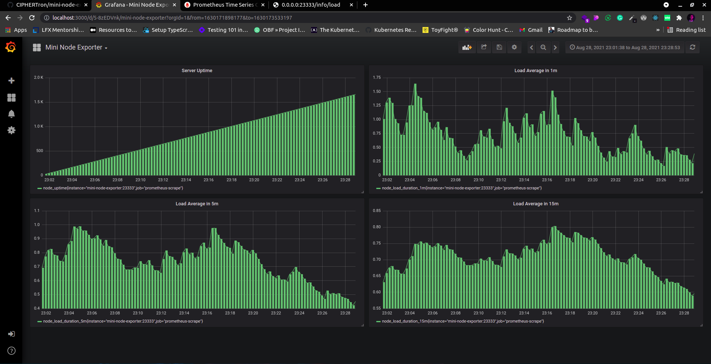

<p align="center">
  <a href="https://github.com/CIPHERTron/mini-node-exporter/">
    
  </a>

  <h3 align="center">Mini Node Exporter</h3>

  <p align="center">
    A mini replica of prometheus/node-exporter where it exposes the basic CPU metrics like uptime, average load, hostname, etc.
  </p>
</p>
<h3 align="center">Link to the Image published on <a href="https://hub.docker.com/layers/ciphertron/mini-node-exporter/latest/images/sha256-d6b460e11403f819968134cf65878a9374268ee61f015ceccbb422c5af5ef6d4?context=explore">Dockerhub 🚀</a></h3>

<!-- TABLE OF CONTENTS -->
<details open="open">
  <summary>Table of Contents</summary>
  <ol>
    <li>
      <a href="#about-the-project">About The Project</a>
      <ul>
      </ul>
        <li><a href="#built-with">Built With</a></li>
    </li>
    <li>
      <a href="#getting-started">Getting Started</a>
      <ul>
        <li><a href="#prerequisites">Prerequisites</a></li>
        <li><a href="#running-the-project">Running the project</a></li>
      </ul>
    </li>
    <li><a href="#relevant-screenshots">Relevant Screenshots</a></li>
  </ol>
</details>

## ℹ️ About The Project

Mini Node Exporter is the simplest form of the famous <a href="https://github.com/prometheus/node-exporter">prometheus/node-exporter</a>. It is basically a type of monitoring stack and an exporter for hardware and OS metrics that is exposed by the <a href="https://github.com/siimon/prom-client">prom-client</a>. The express, prometheus & grafana servers are containerized using Docker & the whole monitoring stack is orchestrated using Docker Compose.



### 🛠️ Built With

Following technologies and libraries are used for the development of this
project.

- [Express.js](https://expressjs.com/)
- [Prometheus](https://prometheus.io/)
- [Grafana](https://grafana.com/)
- [Docker](https://www.docker.com/)
- [Docker Compose](https://docs.docker.com/compose/)
- Shell/CLI

<!-- GETTING STARTED -->

## 📌 Getting Started

To setup the project locally follow the steps below

### 💻 Prerequisites

- [Node.js](https://nodejs.org/en/download/)
- [Docker](https://docs.docker.com/get-docker/)
- [Docker Compose](https://docs.docker.com/compose/install/)

### 🤖 Running the project.

To set this up in the local repository:

1. **Fork** and **clone** the project to your local system
2. Copy the commands below:

```
docker-compose up -d --build mini-node-exporter
docker-compose up -d --build prometheus
docker-compose up -d --build grafana
```

3. Now, there will be three processes running on your system i.e. `mini-node-exporter`, `prometheus`, `grafana`. `mini-node-exporter` will be running at `0.0.0.0:23333` whereas `prometheus` will be running at `0.0.0.0:9090` and `grafana` at `0.0.0.0:3000`.

4. The `mini-node-exporter` application will be having the endpoints as follows:

- `/info/uptime` - Displays the Uptime of the server
- `/info/load` - Displays the average load of the system in 1m, 5m and 15m in the form of a JSON.
- `/metrics` is the endpoint which exposes two gauge metrics i.e `node_load` & `node_uptime`

5. To fetch the `metrics`, open your terminal & run `curl -GET 0.0.0.0:23333/metrics`. This will return all the default as well as custom metrics.
6. Open `0.0.0.0:9090/graph` to view the **Prometheus** dashboard.
7. To view the grafana dashboard, open `0.0.0.0:3000`
8. A valid data source that goes by the name of `Prometheus` is already configured.
9. Now, plot a graph on the Grafana dashboard by the metrics scraped from Prometheus i.e.

- Follow the standard way of adding a new Grafana graph.
- Click the graph title, then click "Edit".
- Under the "Metrics" tab, select your Prometheus data source (bottom right). <br>
  Example mertics: `node_uptime`, `node_load_1m`, `node_load_5m` & `node_load_15m`
- Enter any Prometheus expression into the "Query" field, while using the "Metric" field to lookup metrics via autocompletion.
- To format the legend names of time series, use the "Legend format" input. For example, to show only the method and status labels of a returned query result, separated by a dash, you could use the legend format string {{method}} - {{status}}.
- Tune other graph settings until you have a working graph.

### 📉 Relevant Screenshots:

1. _Prometheus up & running_
   

2. _Adding Metrics In Grafana_
   

3. _Graph of node_uptime in Grafana dashboard_
   

4. _Graph of average load at 1m_
   

5. _Graph of average load at 5m_
   

6. _Graph of average load at 15m_
   
